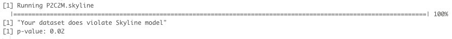

# P2C2M.Skyline

An R-package for assessing model adequacy for Bayesian Skyline Plots using posterior predictive simulation

##Installation:

P2C2M.Skyline can be installed from Github using the function install_github implemented in the devtools R-package.

```{r}
library(devtools)
devtools::install_github("P2C2M/P2C2M_Skyline")
```

P2C2M.Skyline automatically installs all the dependencies, but if you get errors, try to install them individually. Here is the list of all required packages:

```{r}
install.packages("ape")  
install.packages("phytools")  
install.packages("phyclust")
install.packages("pegas")  
```

## Example:

To run P2C2M.Skyline, users need to provide an ultrametric phylogenetic tree (NEXUS format) and the log file resulting from a Bayesian Skyline analyzed in Tracer.

### *Rhinella granulosa* – All samples

We included a *Rhinella* *granulosa* dataset in P2C2M.Skyline as an example. The *Rhinella* *granulosa* dataset includes 86 sequences of a mitochondrial fragment. So, we will investigate if the Skyline model is a good fit for the evolutionary history of *Rhinella* *granulosa*.

Users need to download and provide the path to ms software (Hudson, 2002).

```{r}
library(P2C2M.Skyline)

P2C2M.Skyline(tree.file=system.file("extdata", "Rhinella_granulosa_tree_file.tre", package="P2C2M.Skyline"),
              log.file=system.file("extdata", "Rhinella_granulosa_log_file.txt", package="P2C2M.Skyline"),
              nrep=100,
              dir ="~/Desktop",
              path.to.ms = "~/Desktop/msdir/ms")
```

Analyzing all samples from the *Rhinella granulosa* dataset together represent a violation of the Skyline plot model (*p*-value < 0.05).



References:

Fonseca EM, Duckett JD, Almeida FG, Smith ML, Thomé TMC, Carstens BC. Assessing model adequacy for Bayesian Skyline Plots using posterior predictive simulation. *In review*

Hudson RR. 2002. Generating samples under a Wright-Fisher neutral model of genetic variation. Bioinformatics 18:337–338. DOI: 10.1093/bioinformatics/18.2.337.

